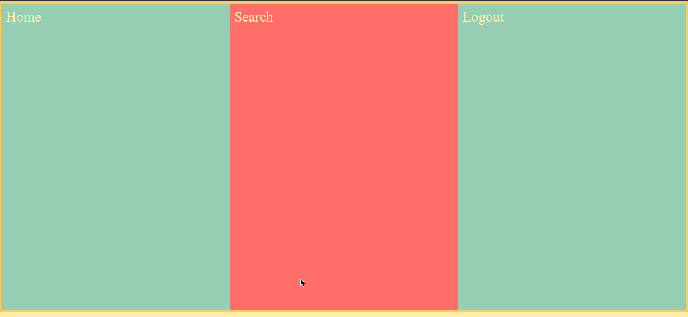

# Flex Property

The `flex` property is a short-hand for `flex-grow`,`flex-shrink`,`flex-basis`. However before understanding those other properties we can use a simple example. We will use the `flex` property to stretch elements to selected axis.

For example

```css

.container
{
  flex-direction: 1;
  justify-content: flex-start;
}
.container>div
{
  
  flex: 1;
}
```

Notice how the `flex` property has to be applied to the items, not to the container (unless the container is also a child from a flex property.)

This would be the result with the given `index.html` used:



