Flex - Example 1.

Here you will see a Flex example using a container and 3 items/elements inside the container. By default many properties are set and they are hidden, this is, they are not explicity shown in CSS code, however they do, in fact, exist or, are set inherently.

Information
    - The container has a `display: flex`
    - The default flex direction is `flex-direction: row`
      - This property sets a main axis. Row = Horizontal, Column = Vertical
    - The default flex justification is: `justify-items: flex-start`
        - The justification aligns with the main axis.
        - The non-main axis is called `cross-axis`
  

## Justify-content

Justification means that content will be "justified/aligned" or moved to the flex's selected axis. That is either vertical (column) or horizontal (row)

Here are some of the possible values for the justify-content. Imagine you will be using the selected options from Microsoft Word.

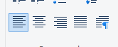

Here are some values you can use:

- Flex-start (align-left/align-top)
- Flex end (align-right/align bot)
- Center
- Space-around
- Space-between
- Space-evenly

### Flex-start + Row direction

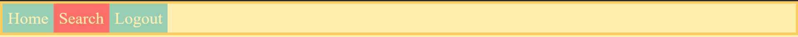

### Center + Row direction
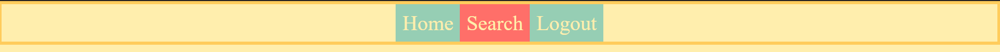
### Flex-end + Row direction

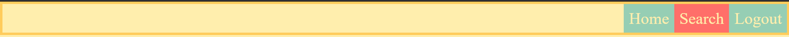

### Flex-start + Column Direction
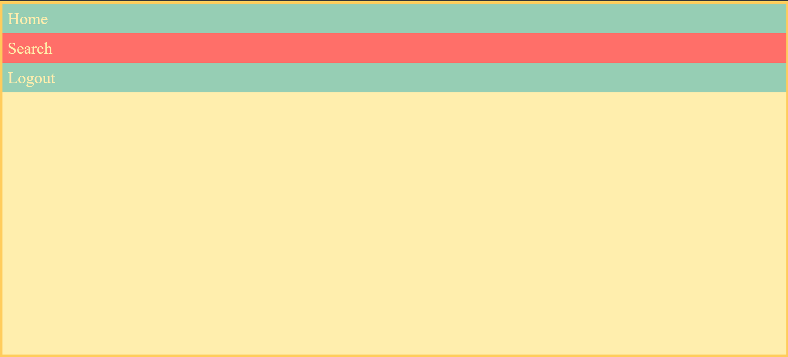
### Center + Column Direction
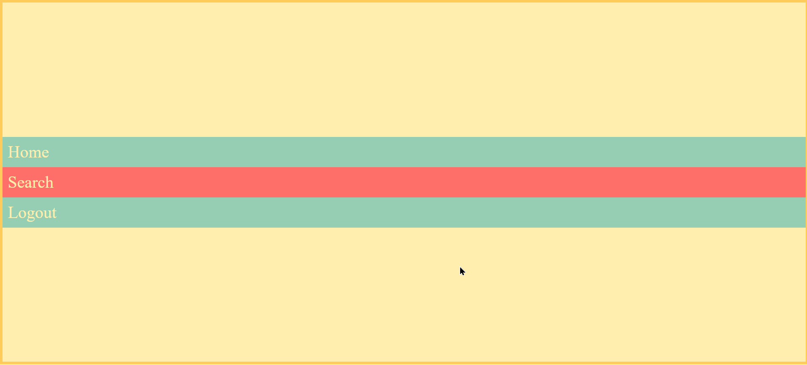
### Flex-end + Column Direction
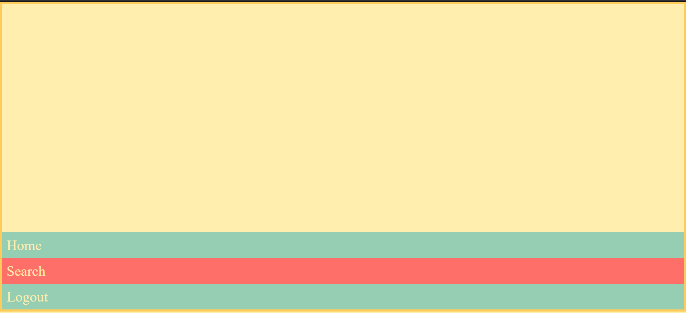

The previous examples show 6 different ways on how to handle justification. Now we are going to see how `space-around`, `space-between` and `space-evenly` work.

### Space-around+row
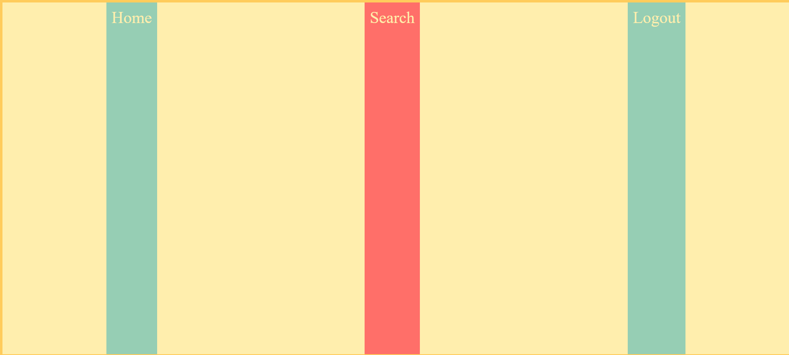
### Space-around+column
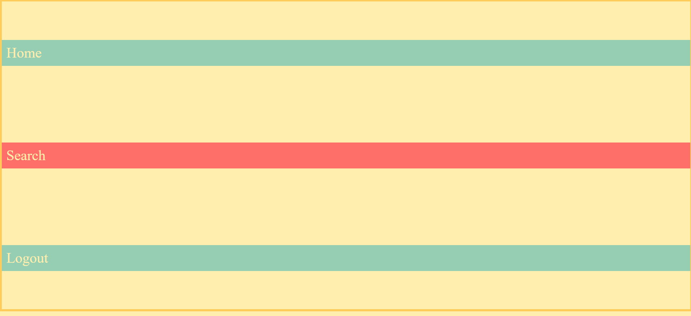

### Space-between+row
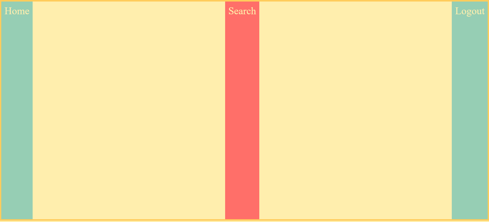
### Space-between+column
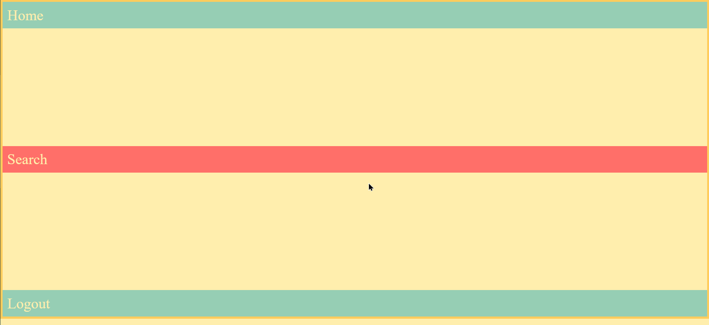
### Space-evenly+row
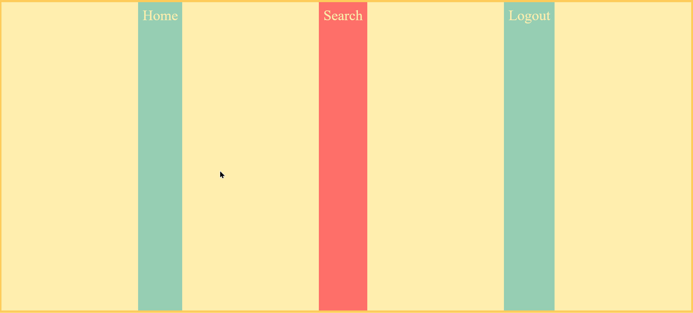
### Space-evenly+column
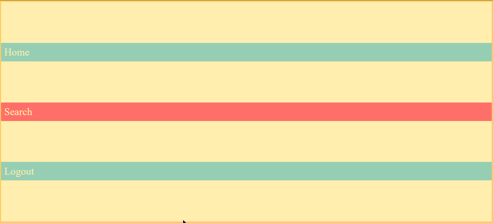

As you can see there are at least 12 combinations on by just using the `flex-direction` and the `justify-content` together. Also notice how the inner elements stretch to the opposite axis to fill the content.